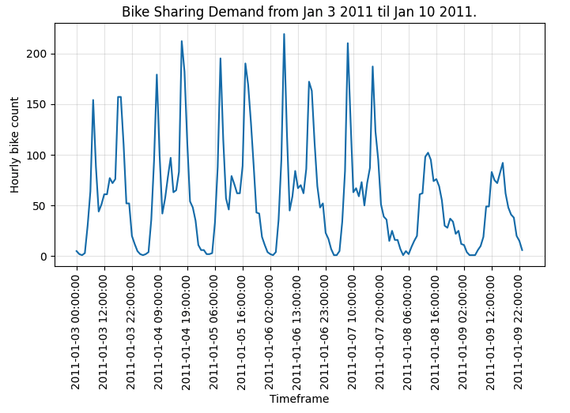
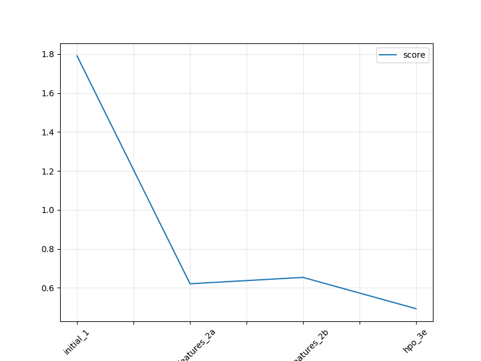

# Report: Predict Bike Sharing Demand with AutoGluon Solution

#### Narmina Yadullayeva

# Table of Contents
1. [Initial Training](#1.-Initial-Training)
2. [Exploratory Data Analysis](#2.-Exploratory-data-analysis-and-feature-creation)
3. [Hyperparameter Optimization](#3.-Hyper-parameter-tuning)
4. [Summary](#4.-Summary)


## 1. Initial Training

* Training dataset consists of 10886 rows and 11 features and 1 target column. Two extra columns that are not present in test dataset (`'casual'`,`'registered'`) are dropped prior to the training. 


* As per instructions, the following hyperparameters were used:
```python
eval_metric = 'root_mean_squared_error'
time_limit = 600
presets='best_quality'
```

* Based on time limit specified, Autogluon defines optimal stacking/ensembling configuration which has several hyperparemeters (will be tuning them. later): 

```python
auto_stack=True 
num_stack_levels=1
num_bag_folds=8
num_bag_sets=20
```


### What did you realize when you tried to submit your predictions? What changes were needed to the output of the predictor to submit your results?

Predicted demand count must be non-negative, therefore additional checks and data alteration needs to be done if negative values are present.

### What was the top ranked model that performed?

#### Experiment 1. 

**Training summary**

The top performing model was found to be a WeightedEnsembleModel followed by RandomForestMSE_BAG_L2 and LightGBM_BAG_L2 - please see leaderboard extracts below:


**Submission results**

After submitting predictions to Kaggle, initial score of **1.79067** was obtained.

## 2. Exploratory data analysis and feature creation
### What did the exploratory analysis find and how did you add additional features?

EDA included plotting histograms, heatmaps and pairwise scatter plots. 

The most important observations were related to timeseries nature of data:

* Overal demand growth trend can be observed across all training dataset timeline. Moderate seasonality associated with season change and large daily variation is present.  


* Drilling down to weekly timeframe, additional daily seasonality can be noted. Additionally, weekend days are tend to be almost twice as low in total bike rent counts when compared to work days.  



* When looking at sample daily demand, there ara 3 spikes in demand observed across morning (7am - 9am), lunch (11am - 1pm), and evening (4 - 7pm). On the other hand, bike demand tends to fall to its lowest levels starting from 11PM till 6AM. 


Taking into consideration above findings, several extra features were created and added into both training and test sets:

* Extracted hour, day, month, year, day of week from `datetime` object.

Autogluon processing step also decomposes datetime feature into several new features:

`('int', ['datetime_as_int']) : 5 | ['datetime', 'datetime.year', 'datetime.month', 'datetime.day', 'datetime.dayofweek']`

* Adding hour category based on daily demand behavior (rush / quite hours). Simple category mapping was applied:

```python
def extract_hour_category(h):
    if h in [7,8,9]:
        return 1
    elif h in [11,12,13]:
        return 2
    elif h in [17,18,19]:
        return 3
    elif h in [23,0,1,2,3,4,5]:
        return 4
    else:
        return 0
```

### How much better did your model preform after adding additional features and why do you think that is?

#### Experiment 2a.

This experiment covers adding newly creating features into training and test datasets.

**Training summary**

* Looking at validation scores, new models performance on training dataset improved. 
* The top performing model was found to be a WeightedEnsembleModel_L3 followed by CatBoost_BAG_L2 and LightGBM_BAG_L2 - please see leaderboard extracts below:


**Submission results**

After submitting predictions to Kaggle, score improved from previous **1.79067** to **0.62078**.

#### Experiment 2b.

* Dropping columns `'datetime_month','datetime_day','datetime_dayofweek','datetime_week','datetime_year'` as they are part of Autogluon Processing step. 

**Training summary**

* Looking at validation scores, new models performance on training dataset is relatively the same as in experiment 2a. 

* The top performing model was found to be a WeightedEnsembleModel_L3 followed by CatBoost_BAG_L2 and LightGBM_BAG_L2 - please see leaderboard extracts below:


**Submission results**

After submitting predictions to Kaggle, score did not improved: from previous **0.62078** to **0.65357**. Conclusion: although processing step creates same features, adding them explicitely helps improving test performance.

---

## 3. Hyper parameter tuning

### How much better did your model preform after trying different hyper parameters?

Two ways of performing hyperparameter tuning were explored:

* Changing model ensembling / stacking hyperparameters at TabularPredictor fit() level

* Changing hyperparameters for each model type.


#### Experiment 3a. 

* Increasing num_stack_levels from 1 to 2.

**Training summary**

* The top performing model was found to be a WeightedEnsembleModel_L3 followed by LightGBM_BAG_L2 and CatBoost_BAG_L2 - please refer to the leaderboard extracts below:


**Submission results**


After submitting predictions to Kaggle, score did not improved: from previous best score of **0.62078** current score decreased to **0.66835**. Conclusion: increasing number of stack levels only doesn't not help in existing case.


#### Experiment 3b.

* Increasing num_bag_folds from 8 to 10.

**Training summary**

* The top performing model was found to be a WeightedEnsembleModel_L3 followed by LightGBM_BAG_L2 and CatBoost_BAG_L2 - please refer to the leaderboard extracts below:


**Submission results**


After submitting predictions to Kaggle, score did not improved: from previous best score of **0.62078** current score decreased to **0.63100**. Conclusion: increasing number of bag folds only doesn't not help in existing case.


#### Experiment 3c.

* Decreasing num_bag_sets from 20 to 5.

**Training summary**

* The top performing model was found to be a WeightedEnsembleModel_L3 followed by LightGBM_BAG_L2 and CatBoost_BAG_L2 - please refer to the leaderboard extracts below:


**Submission results**


After submitting predictions to Kaggle, score did not improved: from previous best score of **0.62078** current score decreased to **0.62247**. Conclusion: increasing number of bag folds only does not really affect score.


#### Experiment 3d.

* This experiment includes hyperparameter tuning on model level. No stacking/ensembling techniques are used. 

**Training summary**

* The top performing model was found to be a WeightedEnsemble_L2 followed by LightGBM models - please refer to the leaderboard extracts below:


**Submission results**


After submitting predictions to Kaggle, score did not improved: from previous best score of **0.62078** current score improved to **0.52253**. Conclusion: models hyperparameter tuning without using ensembling techniques significanlty improves performance. 


#### Experiment 3e.

* This experiment includes hyperparameter tuning on model level as well as using stacking/ensembling techniques. 

**Training summary**

* The top performing model was found to be a WeightedEnsemble_L2 followed by WeightedEnsemble_L3 and LightGBM_BAG_L2 model - please refer to the leaderboard extracts below:


**Submission results**

After submitting predictions to Kaggle, score did not improved: from previous best score of **0.52253** current score improved to **0.49307**. Conclusion: together with ensembling techniques, models hyperparameter tuning significanlty improves performance. 

### If you were given more time with this dataset, where do you think you would spend more time?

Taking into account nature of dataset, I would spend more time on performing additional feature engineering, exploring timeseries modeling techniques and exploring more hyperparameters for extended tuning time.

### Create a table with the models you ran, the hyperparameters modified, and the kaggle score.


### Create a line plot showing the top model score for the three (or more) training runs during the project.



---

## 4. Summary

Feature engineering and wise hyperparameter tuning on model level coupled with ensembling techniques were found to be the most effective in improving predictions.


