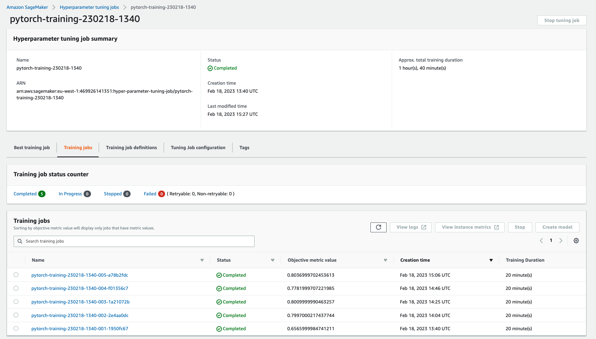
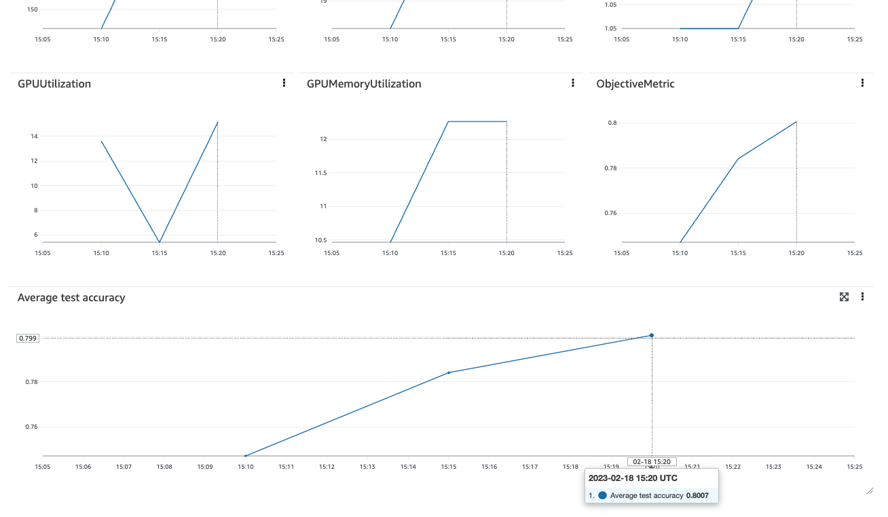
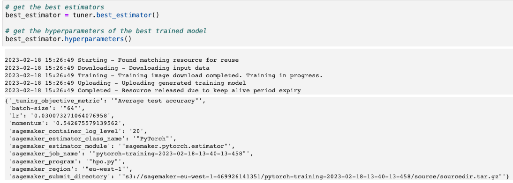
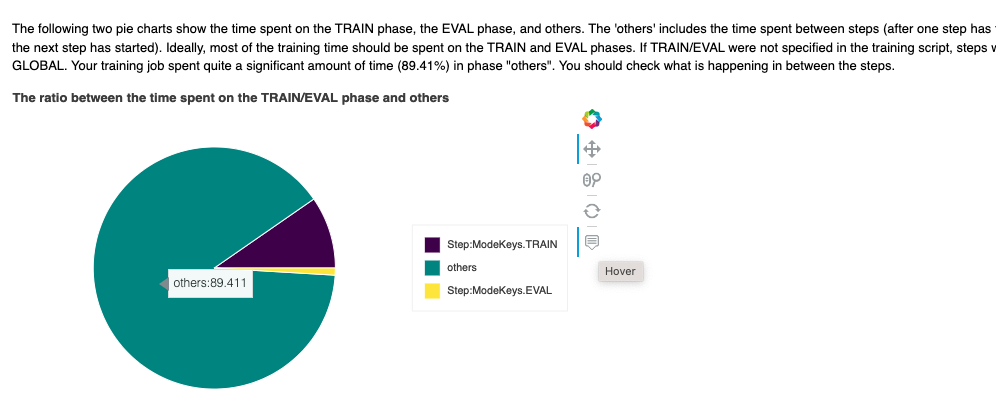
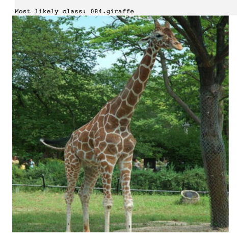
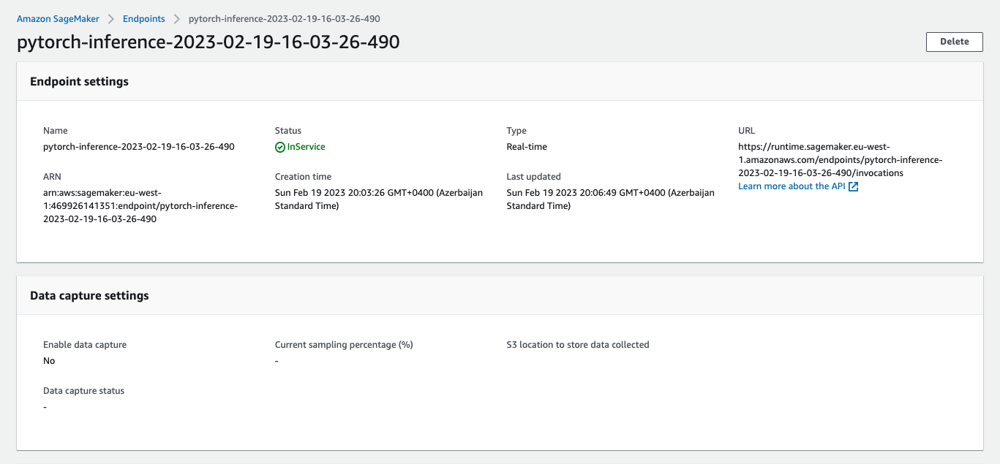

# Image Classification using AWS SageMaker

This project is aimed to use AWS Sagemaker stack to train a pretrained model that can perform image classification by using the Sagemaker profiling, debugger, hyperparameter tuning and other good ML engineering practices.

The idea is to build an image classification system for E-commerce that can automatically tag images of products with relevant keywords, improving search results and making it easier for customers to find what they're looking for. To do that, I will be using transfer learning concept i.e. I will be fine-tuning pre-trained image classification model on the suitable dataset.

Although there might be much better models and datasets to be used for this problem, for the sake of simplicity I will be using Pytorch implementation of Resnet18 model and fine tune it on Caltech256 dataset.

The notebook "train_and_deploy.ipynb" contains all of the steps required to fine-tune, deploy and query image classification model using AWS Sagemaker stack.

## Dataset

For this project I've using CalTech256 dataset. It is an object recognition dataset containing 30,607 real-world images, of different sizes, spanning 257 classes (256 object classes and an additional clutter class). Each class is represented by at least 80 images. The dataset is a superset of the Caltech-101 dataset. You can find more details on the following web pages:

- https://paperswithcode.com/dataset/caltech-256

- https://data.caltech.edu/records/nyy15-4j048

### Access

Following the steps in the `train_and_deploy.ipynb` notebook, dataset is first downloaded to local instance and then uploaded to an S3 bucket through the AWS Gateway so that SageMaker has access to the data.

## Hyperparameter Tuning

I've selected Resnet18 for multiple reasons, but mainly because it has much less parameters to tune and still provides decent performance.

Three hyperparameters I've been tuning were:

- learning rate "lr": ContinuousParameter(0.001, 0.1)
- batch size "batch-size": CategoricalParameter([32, 64, 128, 256, 512])
- SGD momentum "momentum": ContinuousParameter(0.5, 0.9)

I've run 5 different training jobs for 5 epochs with "maximize accuracy" optimization criterion.

**Screenshot of completed training jobs**

**Best training job metrics in Sagemaker UI**

**The best configuration obtained through HPO**

## Debugging and Profiling

Below are some highlights from the profiler report.

- One of the findings were around time distribution between train / eval and others - need to understand what's happening between the phases.

**Suspicios time alocation per activity**

- During the training job, the LowGPUUtilization rule was the most frequently triggered. One of the possible reasons is that the batch size is too small (64), and GPUs are underutilized. Recommendation is to consider running on a smaller instance type (I've used the cheapest and smallest one) or increasing the batch size (batch size was selected based on HP optimization done earlier).

- Initialization took too long as well - might need to look into how to optimize it.

- Training instance provided 4 CPU cores, however the training job only ran on average 1 dataloader workers in parallel. Recommendation is to increase the number of dataloader workers.

### Results

I haven't got much progress on addressing these issues due to credit limit per project (I've run out of credit and had to use a different environment), but this gives me pretty good idea about direction to move toward in order to optimize training performance.

## Model Deployment

After obtaining trained model object from training job `"sagemaker-script-mode-2023-02-19-08-02-08-649"`, deployment was done through re-initiating PyTorchModel object instance and passing path to the model object as an argument. Additionally, separate `inference.py` script was created and placed into `code` directory to provide necessary instructions for model deployment and image classification request logic.

`'pytorch-inference-2023-02-19-16-03-26-490'`.

Three images were tested (1 from Caltech256, 2 random pictures from the internet). In all of the cases, model classified objects correctly.

To query the endpoint, you can paste link to any website image and save as `link_to_image` variable and run respective cell.

**Screenshot of active endpoint in Sagemaker**

